# AI Cluster Ops – `bigboy` AKS Onboarding

A comprehensive knowledge base and automation toolkit for rapidly onboarding new applications to the `bigboy` AKS cluster hosted in Azure.

## 🎯 Purpose

This repository enables engineers (and AI assistants like GitHub Copilot) to quickly deploy new services to the Kubernetes cluster with minimal manual configuration. Provide Copilot with access to this repo and describe your app; it will generate the necessary Kubernetes manifests, Helm charts, and CI/CD pipelines following the guidelines in this repository.

## 📚 Documentation site

All of the markdown under `docs/` is rendered into a MkDocs Material site that automatically publishes to GitHub Pages whenever you update the documentation.

- **Live site**: https://ianlintner.github.io/ai_cluster_ops/
- **Workflow**: `.github/workflows/docs-site.yaml` builds and deploys the site on every push to `main` that touches docs or `mkdocs.yml`.
- **Local preview**:

  ```bash
  python -m pip install --upgrade pip
  pip install -r docs/requirements.txt
  mkdocs serve
  ```

## 🏗️ Architecture overview


## 🔄 Application lifecycle

This repository supports the complete application lifecycle from onboarding to decommissioning.


## 🤖 GitHub Copilot agent

This repo includes a custom Copilot agent for automated deployments. Use `@aks-deploy` in Copilot Chat:

```
@aks-deploy Deploy my Node.js API called user-service
```

```
@aks-deploy Create a Python Flask app with GitHub OAuth authentication
```

### Agent configuration files

| File | Purpose |
|------|---------|
| `.github/agents/aks-deploy.md` | Custom agent definition for Copilot |
| `.github/copilot-chat-agent.md` | Detailed agent instructions with self-update protocol |
| `.github/copilot-agent.yml` | Machine-readable agent configuration |
| `.github/copilot-instructions.md` | Complete deployment instructions |

### Self-updating agent

The agent is configured to fetch the latest configuration from this repository before generating manifests. This ensures deployments always use current:
- Cluster configuration
- Gateway references
- Security requirements
- Key Vault identity

## 📋 Quick start

### For engineers with Copilot

1. **In your app repository**, ensure you have CLI access configured:
   ```bash
   az login
   az aks get-credentials --resource-group nekoc --name bigboy
   ```

2. **Reference this repo** in your Copilot prompt:
   ```
   Using the ai_cluster_ops templates and instructions, deploy my [Node.js/Python/Go] 
   app to the bigboy cluster with hostname [myapp].cat-herding.net
   ```

3. Copilot will generate:
   - Dockerfile (if needed)
   - Kubernetes manifests or Helm chart
   - Istio Gateway/VirtualService
   - TLS certificate configuration
   - GitHub Actions workflow

### Manual onboarding

See [docs/ONBOARDING.md](docs/ONBOARDING.md) for step-by-step instructions.

## 📋 Complete onboarding pipeline

This diagram shows the end-to-end self-service process for onboarding a new application:

```mermaid
sequenceDiagram
    participant Dev as Developer
    participant Copilot as GitHub Copilot
    participant Repo as ai_cluster_ops
    participant AppRepo as App Repository
    participant GHA as GitHub Actions
    participant ACR as Container Registry
    participant AKS as AKS Cluster
    participant KV as Azure Key Vault
    participant DNS as Azure DNS

    Dev->>Copilot: @aks-deploy Deploy my Node.js API "user-service"
    
    Note over Copilot: Self-Update Protocol
    Copilot->>Repo: Fetch latest copilot-instructions.md
    Copilot->>Repo: Fetch cluster configuration
    Copilot->>Repo: Fetch templates
    
    Note over Copilot: Generate Manifests
    Copilot->>AppRepo: Create k8s/deployment.yaml
    Copilot->>AppRepo: Create k8s/service.yaml
    Copilot->>AppRepo: Create k8s/virtualservice.yaml
    Copilot->>AppRepo: Create k8s/secretproviderclass.yaml
    Copilot->>AppRepo: Create .github/workflows/deploy.yaml
    Copilot->>AppRepo: Create Dockerfile (if needed)
    
    Dev->>AppRepo: Review & commit manifests
    Dev->>KV: Create secrets in Key Vault
    Dev->>KV: Grant AKS access to secrets
    
    Note over AppRepo: CI/CD Pipeline Triggered
    AppRepo->>GHA: Push to main branch
    GHA->>GHA: Run tests
    GHA->>ACR: Build & push image
    GHA->>AKS: kubectl apply -f k8s/
    
    Note over AKS: Resources Created
    AKS->>AKS: Create Deployment
    AKS->>AKS: Create Service
    AKS->>AKS: Create VirtualService
    AKS->>AKS: Create SecretProviderClass
    AKS->>KV: Mount secrets via CSI driver
    AKS->>ACR: Pull container image
    AKS->>AKS: Start pod with Istio sidecar
    
    Note over DNS: DNS Already Configured
    DNS-->>AKS: *.cat-herding.net → Istio Gateway
    
    AKS-->>Dev: ✅ Deployment successful
    Dev->>AKS: curl https://user-service.cat-herding.net
    AKS-->>Dev: 200 OK
```



## 🔄 Full application lifecycle management

### Phase 1: Planning and design

**What to decide:**
- Application name and subdomain (e.g., `myapp.cat-herding.net`)
- Authentication needs (public, OAuth, service-to-service)
- Secret requirements (database credentials, API keys)
- Resource requirements (CPU, memory)
- Dependencies (databases, external APIs)

**Tools:**
- Review `docs/ONBOARDING.md` for requirements
- Check existing patterns in `manifests/examples/`

### Phase 2: Generation (self-service with Copilot)

```bash
# In your app repository
@aks-deploy Deploy my [language] app called [name] with [requirements]
```

**Generated artifacts:**
- ✅ Kubernetes manifests (deployment, service, virtualservice)
- ✅ Azure Key Vault SecretProviderClass
- ✅ GitHub Actions CI/CD workflow
- ✅ Dockerfile (if needed)

**What Copilot ensures:**
- Istio sidecar injection annotations
- Security context (runAsNonRoot, no privilege escalation)
- Resource limits
- Health probes (liveness, readiness, startup)
- Shared gateway reference
- Spot instance tolerations

### Phase 3: Build

```bash
# Push to trigger CI/CD
git add k8s/ .github/workflows/ Dockerfile
git commit -m "Add Kubernetes manifests"
git push origin main
```

**GitHub Actions will:**
1. Run tests (if configured)
2. Build Docker image
3. Push to `gabby.azurecr.io/[app-name]:[sha]`
4. Tag as `:latest`

### Phase 4: Deploy

**Automated deployment:**
```yaml
# GitHub Actions automatically runs:
kubectl apply -f k8s/deployment.yaml
kubectl apply -f k8s/service.yaml
kubectl apply -f k8s/virtualservice.yaml
kubectl apply -f k8s/secretproviderclass.yaml
```

**Verify deployment:**
```bash
kubectl rollout status deployment/myapp
kubectl get pods -l app=myapp
kubectl get virtualservice myapp
curl -I https://myapp.cat-herding.net
```

### Phase 5: Operate

**Monitoring:**
- View traces in Azure Monitor (via OpenTelemetry)
- Check logs: `kubectl logs -l app=myapp -f`
- View metrics in Azure Monitor

**Troubleshooting:**
- See `docs/TROUBLESHOOTING.md`
- Check pod status: `kubectl describe pod [pod-name]`
- Check Istio sidecar: `kubectl logs [pod-name] -c istio-proxy`

### Phase 6: Update

**Update application code:**
```bash
# Push changes - CI/CD automatically rebuilds and deploys
git push origin main
```

**Update Kubernetes configuration:**
```bash
# Edit manifests
vi k8s/deployment.yaml

# Apply changes
kubectl apply -f k8s/deployment.yaml
```

**Update secrets:**
```bash
# Update in Key Vault
az keyvault secret set --vault-name myapp-kv --name api-key --value "new-value"

# Secrets auto-rotate every 2 minutes
# Or force pod restart:
kubectl rollout restart deployment/myapp
```

**Scale application:**
```bash
# Manual scaling
kubectl scale deployment/myapp --replicas=5

# Or enable HPA in helm values
helm upgrade myapp ./helm/app-template \
  --set autoscaling.enabled=true \
  --set autoscaling.minReplicas=2 \
  --set autoscaling.maxReplicas=10
```

### Phase 7: Decommission

When an application is no longer needed, follow this process to cleanly remove all resources.


#### Step 1: Prepare for Decommission

**Document dependencies:**
```bash
# Check what services depend on this app
kubectl get virtualservices -A -o yaml | grep -A5 "myapp"
kubectl get authorizationpolicies -A -o yaml | grep "myapp"

# Check DNS records
az network dns record-set list -g nekoc -z cat-herding.net | grep myapp
```

**Notify stakeholders:**
- Alert users of upcoming decommission
- Document migration path (if applicable)
- Set decommission date

#### Step 2: Remove External Traffic

**Option A: Soft shutdown (redirect to maintenance page)**
```yaml
# Edit VirtualService to redirect traffic
apiVersion: networking.istio.io/v1beta1
kind: VirtualService
metadata:
  name: myapp
spec:
  hosts:
    - myapp.cat-herding.net
  gateways:
    - aks-istio-ingress/cat-herding-gateway
  http:
    - match:
        - uri:
            prefix: /
      redirect:
        uri: /maintenance
        authority: status.cat-herding.net
```

**Option B: Scale down to zero**
```bash
kubectl scale deployment/myapp --replicas=0
```

#### Step 3: Delete Kubernetes Resources

```bash
# Delete all resources in correct order
kubectl delete virtualservice myapp
kubectl delete service myapp
kubectl delete deployment myapp
kubectl delete secretproviderclass myapp-secrets
kubectl delete serviceaccount myapp
kubectl delete configmap myapp-config
kubectl delete hpa myapp

# Or delete entire namespace if app has dedicated namespace
kubectl delete namespace myapp-namespace

# Verify cleanup
kubectl get all -l app=myapp
```

#### Step 4: Clean Up Azure Resources

**Remove Key Vault (if dedicated to this app):**
```bash
# List Key Vault
az keyvault list -g nekoc --query "[?contains(name, 'myapp')]"

# Soft delete (recoverable for 90 days)
az keyvault delete --name myapp-kv --resource-group nekoc

# Permanent delete (optional, after verification)
az keyvault purge --name myapp-kv
```

**Remove Azure Monitor alerts:**
```bash
# List alerts for the app
az monitor metrics alert list -g nekoc --query "[?contains(name, 'myapp')]"

# Delete alerts
az monitor metrics alert delete --name myapp-alert -g nekoc
```

**Remove DNS records (if custom A record was created):**
```bash
# Only if you created a specific A record (most apps use wildcard)
az network dns record-set a delete \
  -g nekoc \
  -z cat-herding.net \
  -n myapp
```

**Remove container images (optional):**
```bash
# List images
az acr repository list --name gabby --output table

# Delete repository
az acr repository delete --name gabby --repository myapp --yes

# Or delete specific tags
az acr repository delete --name gabby --image myapp:v1.0.0 --yes
```

#### Step 5: Remove CI/CD

**Delete GitHub Actions workflow:**
```bash
# In your app repository
rm .github/workflows/deploy.yaml
git add .github/workflows/deploy.yaml
git commit -m "Remove deployment workflow - app decommissioned"
git push
```

**Archive or delete app repository:**
```bash
# Option A: Archive (recommended)
# Go to GitHub repo Settings → Archive this repository

# Option B: Delete (permanent)
# Go to GitHub repo Settings → Delete this repository
```

#### Step 6: Archive Documentation

**Create decommission record:**
```bash
# In ai_cluster_ops repo
mkdir -p docs/decommissioned
cat > docs/decommissioned/myapp.md << 'EOF'
# myapp - Decommissioned

- **Decommission Date**: 2025-12-01
- **Reason**: Service replaced by new-service
- **Former URL**: https://myapp.cat-herding.net
- **Migration Path**: Users migrated to https://new-service.cat-herding.net
- **Data Retention**: Database backed up to azure-storage/backups/myapp-final.sql
- **Repository**: Archived at https://github.com/ianlintner/myapp

## Resources Cleaned Up
- [x] Kubernetes resources deleted
- [x] Key Vault deleted
- [x] Container images deleted
- [x] DNS records removed
- [x] GitHub Actions disabled
EOF
```

**Update cluster documentation:**
```bash
# Remove from docs/CLUSTER_OVERVIEW.md existing services table
# Update any references in docs/ONBOARDING.md or examples
```

#### Decommission Checklist

```bash
# Use this checklist for each decommission
cat > scripts/decommission-checklist.md << 'EOF'
## Decommission Checklist for: [APP_NAME]

### Pre-Decommission
- [ ] Document all dependencies
- [ ] Notify stakeholders
- [ ] Set decommission date
- [ ] Plan data migration/backup
- [ ] Review compliance requirements

### Kubernetes Resources
- [ ] Scale deployment to 0 replicas
- [ ] Delete VirtualService
- [ ] Delete Service
- [ ] Delete Deployment
- [ ] Delete SecretProviderClass
- [ ] Delete ConfigMaps
- [ ] Delete ServiceAccount
- [ ] Delete HPA (if exists)
- [ ] Verify no resources remain: `kubectl get all -l app=[APP_NAME]`

### Azure Resources
- [ ] Delete/Purge Key Vault
- [ ] Remove Azure Monitor alerts
- [ ] Delete custom DNS records (if any)
- [ ] Delete container images (optional)
- [ ] Remove IAM role assignments

### CI/CD & Repository
- [ ] Delete GitHub Actions workflow
- [ ] Archive or delete repository
- [ ] Remove webhooks

### Documentation
- [ ] Create decommission record
- [ ] Update cluster documentation
- [ ] Remove from examples
- [ ] Update architecture diagrams

### Final Verification
- [ ] URL returns 404 or redirects properly
- [ ] No pods running: `kubectl get pods -l app=[APP_NAME]`
- [ ] No alerts firing
- [ ] Data backed up (if required)
- [ ] Stakeholders notified of completion
EOF
```

## 🏗️ Cluster Architecture

| Component | Description |
|-----------|-------------|
| **AKS Cluster** | `bigboy` in `centralus`, Kubernetes 1.32.9 |
| **Resource Group** | `nekoc` |
| **Container Registry** | `gabby.azurecr.io` |
| **Service Mesh** | Azure Managed Istio (ASM 1.27) |
| **TLS Certificates** | cert-manager with Let's Encrypt |
| **Ingress** | Istio Gateway (external: 52.182.228.75) |
| **DNS Zones** | `cat-herding.net`, `hugecat.net` |
| **Observability** | OpenTelemetry Collector + Azure Monitor |

## 📊 Key Concepts

### Self-Service Onboarding


**What makes it self-service:**
1. **No cluster admin needed** - Copilot generates compliant manifests
2. **No manual certificate creation** - Wildcard cert covers all subdomains
3. **No gateway configuration** - Shared gateway handles all traffic
4. **No manual secret creation** - Key Vault CSI driver handles secrets
5. **No networking setup** - DNS wildcard and Istio handle routing

### Istio Service Mesh Integration


### Azure Key Vault Secrets Flow


## 📁 Repository Structure

```
ai_cluster_ops/
├── .github/
│   ├── agents/
│   │   └── aks-deploy.md          # Custom Copilot agent
│   ├── copilot-agent.yml          # Agent configuration (YAML)
│   ├── copilot-chat-agent.md      # Agent instructions
│   ├── copilot-instructions.md    # AI assistant context
│   └── workflows/                  # Reusable CI/CD templates
├── docs/
│   ├── CLUSTER_OVERVIEW.md        # Detailed cluster architecture
│   ├── ONBOARDING.md              # Step-by-step guide
│   ├── TROUBLESHOOTING.md         # Common issues & solutions
│   ├── SECURITY.md                # Security best practices
│   ├── OBSERVABILITY.md           # OpenTelemetry integration
│   └── decommissioned/            # Archived app records
├── helm/
│   └── app-template/              # Base Helm chart for apps
├── manifests/
│   ├── base/                      # Base Kustomize resources
│   └── examples/                  # Example deployments
├── templates/
│   ├── deployment/                # Deployment templates
│   ├── istio/                     # Gateway/VirtualService templates
│   ├── certificates/              # TLS certificate templates
│   └── oauth2/                    # OAuth2 proxy templates
└── scripts/
    ├── deploy.sh                  # Deployment helper
    ├── validate.sh                # Pre-deployment validation
    └── decommission-checklist.md  # Decommission guide
```

## 🔧 Available Templates

| Template | Use Case |
|----------|----------|
| `simple-web` | Static sites, simple APIs (no auth) |
| `authenticated-web` | Apps requiring GitHub OAuth |
| `api-service` | Backend APIs with health checks |
| `full-stack` | Apps with database/Redis dependencies |

## 📡 DNS & Ingress

Apps deployed to this cluster automatically get:
- **Wildcard DNS**: `*.cat-herding.net` → 52.182.228.75
- **Wildcard TLS**: Automatic HTTPS via Let's Encrypt
- **Istio sidecar**: Automatic mTLS between services

Simply create a VirtualService pointing to your subdomain!

## 🔐 Authentication Options

1. **No Auth** - Public endpoints
2. **OAuth2 Proxy Sidecar** - GitHub OAuth protection
3. **Istio AuthorizationPolicy** - Service-to-service auth

## 📊 Observability

Every application deployed to the cluster is automatically instrumented for comprehensive observability:


### The Three Pillars

**1. Distributed Tracing**
- Automatic via Istio service mesh (HTTP, gRPC)
- OpenTelemetry SDK for custom spans
- End-to-end request tracking across services
- Trace correlation with logs via trace_id

**2. Metrics**
- **Istio metrics** - Request rate, latency, errors (automatic)
- **Application metrics** - Custom business metrics via OTEL
- **Golden Signals** - Latency, traffic, errors, saturation
- **RED Metrics** - Rate, errors, duration

**3. Structured Logging**
- JSON format to stdout/stderr
- Automatic collection by Kubernetes
- Forwarded to Azure Log Analytics
- Correlated with traces via trace_id/span_id

### Quick Setup

Add to your deployment:

```yaml
env:
  # OpenTelemetry configuration
  - name: OTEL_EXPORTER_OTLP_ENDPOINT
    value: "http://otel-collector.default.svc.cluster.local:4317"
  - name: OTEL_SERVICE_NAME
    value: "myapp"
  - name: OTEL_RESOURCE_ATTRIBUTES
    value: "deployment.environment=production"
  - name: OTEL_TRACES_SAMPLER
    value: "parentbased_traceidratio"
  - name: OTEL_TRACES_SAMPLER_ARG
    value: "0.1"  # 10% sampling
```

### Best Practices

✅ **Use structured logging (JSON)**
```javascript
logger.info('Order created', { 
  order_id: '12345',
  amount: 99.99,
  trace_id: traceId  // For correlation
});
```

✅ **Add custom spans for key operations**
```javascript
const span = tracer.startSpan('process_payment');
span.setAttribute('payment.method', 'credit_card');
// ... process payment
span.end();
```

✅ **Export metrics for business KPIs**
```javascript
const orderCounter = meter.createCounter('orders.created');
orderCounter.add(1, { 'order.type': 'premium' });
```

✅ **Always log to stdout/stderr** (not files)
```javascript
// Kubernetes automatically captures stdout
console.log(JSON.stringify({ level: 'info', msg: 'Started' }));
```

❌ **Don't log secrets or PII**
```javascript
// NEVER do this:
logger.info('User login', { password: '...' });
```

### Viewing Observability Data

```bash
# View logs
kubectl logs -l app=myapp -f

# View logs with trace correlation
kubectl logs -l app=myapp | grep "trace_id"

# Check metrics in Azure Monitor
az monitor metrics list --resource <aks-resource-id>

# Query logs in Log Analytics
az monitor log-analytics query \
  --workspace <workspace-id> \
  --analytics-query "ContainerLog | where ContainerName == 'myapp'"
```

📚 **Full guide**: See [docs/OBSERVABILITY.md](docs/OBSERVABILITY.md) for:
- Language-specific OpenTelemetry setup (Node.js, Python, Go)
- Trace context propagation
- Custom metrics and spans
- Log correlation patterns
- Performance optimization
- Cost management
- Complete working examples

## 🚀 Deployment Patterns

### Pattern 1: Helm Chart (Recommended)
```bash
helm upgrade --install myapp ./helm/app-template \
  --set app.name=myapp \
  --set app.image=gabby.azurecr.io/myapp:latest \
  --set app.hostname=myapp.cat-herding.net
```

### Pattern 2: kubectl with Templates
```bash
# Generate manifests
./scripts/generate.sh myapp myapp.cat-herding.net

# Apply
kubectl apply -f generated/myapp/
```

### Pattern 3: Kustomize
```bash
kubectl apply -k manifests/overlays/myapp/
```

## 📝 License

Internal use only - Nekoc Labs
