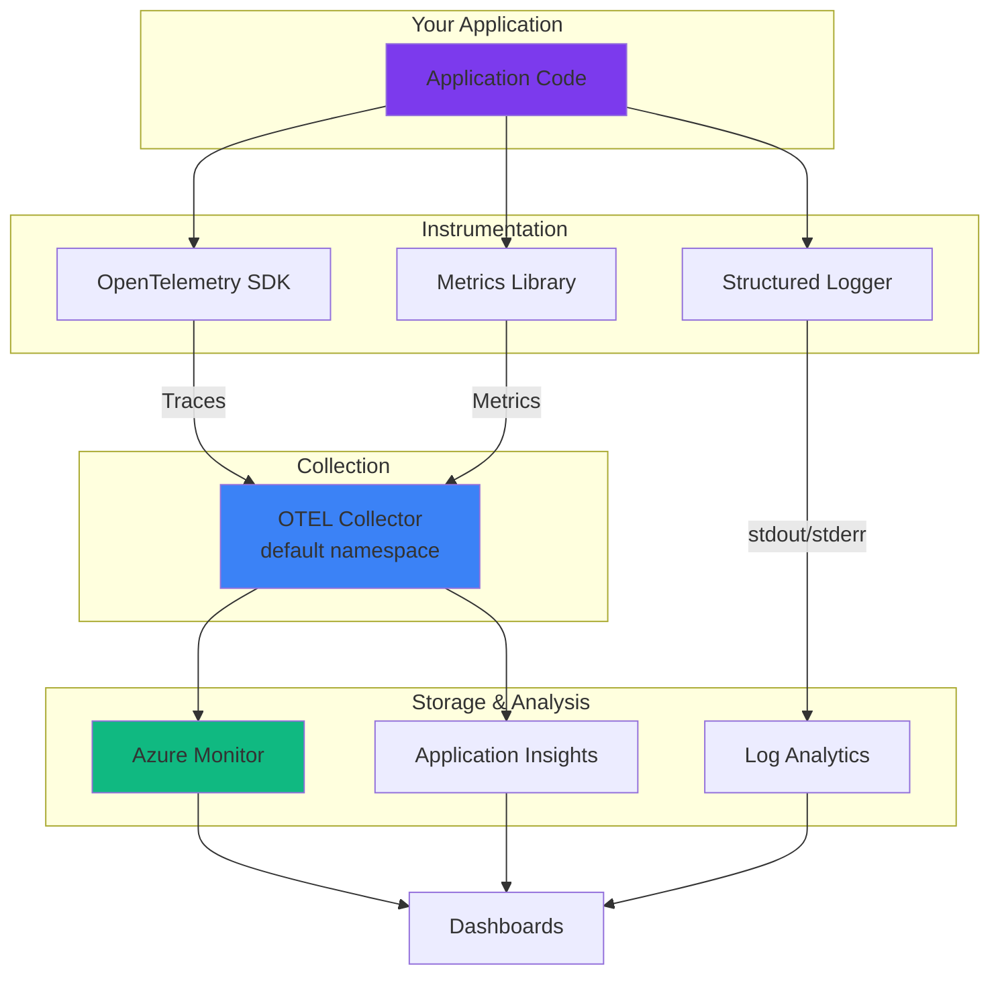
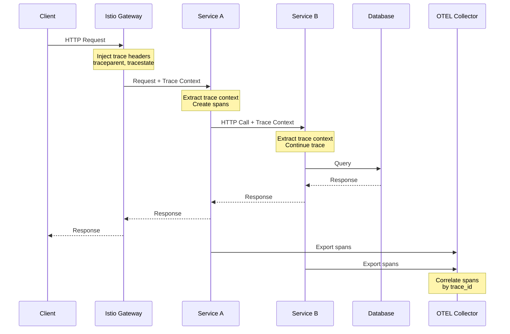

# Observability guide

A comprehensive guide to instrumenting your applications with OpenTelemetry, implementing structured logging, collecting metrics, and following observability best practices on the `bigboy` AKS cluster.

## Table of contents

- [OpenTelemetry integration](#opentelemetry-integration)
- [Distributed tracing](#distributed-tracing)
- [Metrics collection](#metrics-collection)
- [Structured logging](#structured-logging)
- [Health endpoints](#health-endpoints)
- [Alerting](#alerts-azure-monitor)
- [Observability best practices](#observability-best-practices)

---

## The three pillars of observability



## OpenTelemetry integration

The cluster runs a centralized OpenTelemetry Collector that can receive traces and metrics from your applications.

### Collector endpoints

| Protocol | Endpoint | Port |
|----------|----------|------|
| gRPC | otel-collector.default.svc.cluster.local | 4317 |
| HTTP | otel-collector.default.svc.cluster.local | 4318 |

### Quick setup

Add these environment variables to your deployment:

```yaml
env:
  - name: OTEL_EXPORTER_OTLP_ENDPOINT
    value: "http://otel-collector.default.svc.cluster.local:4317"
  - name: OTEL_SERVICE_NAME
    value: "myapp"
  - name: OTEL_RESOURCE_ATTRIBUTES
    value: "deployment.environment=production,service.namespace=default"
```

Or enable via Helm:

```yaml
otel:
  enabled: true
```

### Language-specific setup

#### Node.js

```bash
npm install @opentelemetry/auto-instrumentations-node
```

```javascript
// tracing.js - Import before other modules
const { NodeSDK } = require('@opentelemetry/sdk-node');
const { getNodeAutoInstrumentations } = require('@opentelemetry/auto-instrumentations-node');
const { OTLPTraceExporter } = require('@opentelemetry/exporter-trace-otlp-grpc');

const sdk = new NodeSDK({
  traceExporter: new OTLPTraceExporter(),
  instrumentations: [getNodeAutoInstrumentations()],
});

sdk.start();
```
```

---

## Distributed tracing

Distributed tracing helps you understand request flows across multiple services.

### Trace context propagation



### Best practices for tracing

#### 1. Always propagate context

```javascript
// Node.js - Automatic with OpenTelemetry
const axios = require('axios');

// Context is automatically propagated in headers
const response = await axios.get('http://other-service/api');
```

```python
# Python - Automatic with OpenTelemetry auto-instrumentation
import requests

# Context automatically propagated
response = requests.get('http://other-service/api')
```

#### 2. Add custom spans for important operations

```javascript
// Node.js
const { trace } = require('@opentelemetry/api');

async function processOrder(orderId) {
  const tracer = trace.getTracer('myapp');
  const span = tracer.startSpan('process_order');
  
  span.setAttribute('order.id', orderId);
### Viewing in Azure Portal

1. Go to Azure Portal → Monitor → Metrics
2. Select the AKS cluster resource
3. Choose Prometheus metrics namespace
4. Select Istio metrics

### Querying Istio Metrics

```promql
# Request rate by service
rate(istio_requests_total[5m])

# Error rate (percentage)
sum(rate(istio_requests_total{response_code=~"5.."}[5m]))
/
sum(rate(istio_requests_total[5m])) * 100

# P95 latency
histogram_quantile(0.95, 
  rate(istio_request_duration_milliseconds_bucket[5m])
)

# Top services by traffic
topk(10, sum by (destination_service_name) (
  rate(istio_requests_total[5m])
))
```

---

## Structured Logging

### Why Structured Logging?

- **Easy parsing** - JSON logs can be queried efficiently
- **Better correlation** - Include trace_id to link logs with traces
- **Rich context** - Add custom fields without parsing log messages
- **Alerting** - Create alerts based on structured fields

### Logging Best Practices

#### 1. Use JSON Format

```javascript
// Node.js with Winston
const winston = require('winston');

const logger = winston.createLogger({
  format: winston.format.combine(
    winston.format.timestamp(),
    winston.format.errors({ stack: true }),
    winston.format.json()
  ),
  defaultMeta: { 
    service: process.env.OTEL_SERVICE_NAME || 'myapp',
    environment: process.env.NODE_ENV || 'production'
  },
  transports: [
    new winston.transports.Console()
  ],
});

// Usage
logger.info('Order created', {
  order_id: '12345',
  user_id: 'user-789',
  amount: 99.99,
  currency: 'USD'
});

// Output:
// {
//   "level": "info",
//   "message": "Order created",
//   "timestamp": "2025-12-01T10:30:00.000Z",
//   "service": "myapp",
//   "environment": "production",
//   "order_id": "12345",
//   "user_id": "user-789",
//   "amount": 99.99,
//   "currency": "USD"
// }
```

```python
# Python with structlog
import structlog

structlog.configure(
    processors=[
        structlog.stdlib.filter_by_level,
        structlog.stdlib.add_logger_name,
        structlog.stdlib.add_log_level,
        structlog.stdlib.PositionalArgumentsFormatter(),
        structlog.processors.TimeStamper(fmt="iso"),
        structlog.processors.StackInfoRenderer(),
        structlog.processors.format_exc_info,
        structlog.processors.UnicodeDecoder(),
        structlog.processors.JSONRenderer()
    ],
    context_class=dict,
    logger_factory=structlog.stdlib.LoggerFactory(),
    cache_logger_on_first_use=True,
)

logger = structlog.get_logger()

# Usage
logger.info(
    "order_created",
    order_id="12345",
    user_id="user-789",
    amount=99.99,
    currency="USD"
)
```

```go
// Go with zap
import "go.uber.org/zap"

logger, _ := zap.NewProduction()
defer logger.Sync()

logger.Info("Order created",
    zap.String("order_id", "12345"),
    zap.String("user_id", "user-789"),
    zap.Float64("amount", 99.99),
    zap.String("currency", "USD"),
)
```

#### 2. Correlate Logs with Traces

Include trace and span IDs in every log:

```javascript
// Node.js - Automatic correlation
const { trace } = require('@opentelemetry/api');
const winston = require('winston');

// Custom formatter to inject trace context
const addTraceContext = winston.format((info) => {
  const span = trace.getActiveSpan();
  if (span) {
    const spanContext = span.spanContext();
    info.trace_id = spanContext.traceId;
    info.span_id = spanContext.spanId;
    info.trace_flags = spanContext.traceFlags;
  }
  return info;
});

const logger = winston.createLogger({
  format: winston.format.combine(
    addTraceContext(),
    winston.format.timestamp(),
    winston.format.json()
  ),
  transports: [new winston.transports.Console()],
});

// Now all logs include trace_id and span_id
logger.info('Processing payment', { amount: 100 });
// {
//   "level": "info",
//   "message": "Processing payment",
//   "amount": 100,
//   "trace_id": "a1b2c3d4e5f6g7h8i9j0",
//   "span_id": "1234567890abcdef",
//   "timestamp": "2025-12-01T10:30:00.000Z"
// }
```

```python
# Python - Automatic with structlog + OpenTelemetry
from opentelemetry import trace
import structlog

def add_trace_context(logger, method_name, event_dict):
    span = trace.get_current_span()
    if span:
        ctx = span.get_span_context()
        event_dict['trace_id'] = format(ctx.trace_id, '032x')
        event_dict['span_id'] = format(ctx.span_id, '016x')
    return event_dict

structlog.configure(
    processors=[
        add_trace_context,
        structlog.processors.TimeStamper(fmt="iso"),
        structlog.processors.JSONRenderer()
    ]
)
```

#### 3. Log Levels - When to Use Each

```javascript
// TRACE - Very detailed, usually disabled
logger.trace('Entering function', { function: 'processOrder' });

// DEBUG - Detailed info for debugging (dev/staging)
logger.debug('Database query', { query: 'SELECT * FROM orders', duration_ms: 45 });

// INFO - General informational messages (default in production)
logger.info('Order created', { order_id: '12345', user_id: 'user-789' });

// WARN - Something unexpected but not an error
logger.warn('Slow database query', { query: 'SELECT ...', duration_ms: 2000 });

// ERROR - Error that was handled
logger.error('Payment failed', { 
  error: error.message,
  order_id: '12345',
  payment_method: 'credit_card'
});

// FATAL - Severe error causing shutdown (rarely used)
logger.fatal('Database connection lost', { error: error.message });
```

#### 4. What to Log

**✅ DO Log:**
- Request/response IDs
- User IDs (not PII)
- Important business events
- Error conditions with context
- Performance metrics (duration, size)
- External API calls
- Database queries (without sensitive data)

**❌ DON'T Log:**
- Passwords or secrets
- Credit card numbers
- Social Security Numbers
- API keys or tokens
- Full request/response bodies (unless needed for debugging)
- Excessive logs in hot paths

#### 5. Sampling High-Volume Logs

```javascript
// Sample logs in high-traffic scenarios
let logCounter = 0;
const SAMPLE_RATE = 100; // Log 1 in 100

function processRequest(req) {
  logCounter++;
  
  if (logCounter % SAMPLE_RATE === 0) {
    logger.debug('Request details', {
      path: req.path,
      query: req.query,
      headers: req.headers
    });
  }
}
```

## Logging
    span.setStatus({ code: 0 }); // Success
  } catch (error) {
    span.setStatus({ code: 2, message: error.message }); // Error
    span.recordException(error);
    throw error;
  } finally {
    span.end();
  }
}
```

```python
# Python
from opentelemetry import trace

tracer = trace.get_tracer(__name__)

async def process_order(order_id):
    with tracer.start_as_current_span("process_order") as span:
        span.set_attribute("order.id", order_id)
        span.set_attribute("order.type", "standard")
        
        try:
            await validate_order(order_id)
            await charge_payment(order_id)
            await ship_order(order_id)
        except Exception as e:
            span.set_status(trace.Status(trace.StatusCode.ERROR))
            span.record_exception(e)
            raise
```

#### 3. Add Semantic Attributes

Use [OpenTelemetry Semantic Conventions](https://opentelemetry.io/docs/specs/semconv/):

```javascript
span.setAttribute('http.method', 'POST');
span.setAttribute('http.url', '/api/orders');
span.setAttribute('http.status_code', 201);
span.setAttribute('db.system', 'postgresql');
span.setAttribute('db.statement', 'SELECT * FROM orders WHERE id = $1');
span.setAttribute('messaging.system', 'kafka');
span.setAttribute('messaging.destination', 'orders-topic');
```

#### 4. Sample Traces Intelligently

```yaml
# In deployment manifest
env:
  - name: OTEL_TRACES_SAMPLER
    value: "parentbased_traceidratio"
  - name: OTEL_TRACES_SAMPLER_ARG
    value: "0.1"  # Sample 10% of traces
```

For production with high traffic, use adaptive sampling:

```javascript
// Node.js - Custom sampler
const { ParentBasedSampler, TraceIdRatioBasedSampler } = require('@opentelemetry/sdk-trace-base');

const sampler = new ParentBasedSampler({
  root: new TraceIdRatioBasedSampler(0.1), // 10% for root spans
});
```

#### 5. Link Related Traces

```javascript
// Link current trace to a previous async operation
const { context, trace } = require('@opentelemetry/api');

function processCallback(previousTraceContext) {
  const span = tracer.startSpan('callback_handler', {
    links: [{ context: previousTraceContext }]
  });
  
  // ... process callback
  span.end();
}
```

---

## Metrics Collection

### Application Metrics

Export custom metrics alongside traces:

```javascript
// Node.js
const { MeterProvider, PeriodicExportingMetricReader } = require('@opentelemetry/sdk-metrics');
const { OTLPMetricExporter } = require('@opentelemetry/exporter-metrics-otlp-grpc');

const metricExporter = new OTLPMetricExporter();
const meterProvider = new MeterProvider({
  readers: [new PeriodicExportingMetricReader({
    exporter: metricExporter,
    exportIntervalMillis: 60000, // Export every minute
  })],
});

const meter = meterProvider.getMeter('myapp');

// Counter - monotonically increasing
const orderCounter = meter.createCounter('orders.created', {
  description: 'Number of orders created',
});
orderCounter.add(1, { 'order.type': 'standard' });

// Histogram - distribution of values
const requestDuration = meter.createHistogram('http.request.duration', {
  description: 'HTTP request duration',
  unit: 'ms',
});
requestDuration.record(156, { 'http.method': 'GET', 'http.route': '/api/orders' });

// UpDownCounter - can increase or decrease
const activeConnections = meter.createUpDownCounter('db.connections.active');
activeConnections.add(1);  // Connection opened
activeConnections.add(-1); // Connection closed

// Gauge - current value
const queueSize = meter.createObservableGauge('queue.size', {
  description: 'Current queue size',
});
queueSize.addCallback((result) => {
  result.observe(getQueueSize());
});
```

```python
# Python
from opentelemetry import metrics
from opentelemetry.sdk.metrics import MeterProvider
from opentelemetry.sdk.metrics.export import PeriodicExportingMetricReader
from opentelemetry.exporter.otlp.proto.grpc.metric_exporter import OTLPMetricExporter

exporter = OTLPMetricExporter()
reader = PeriodicExportingMetricReader(exporter, export_interval_millis=60000)
provider = MeterProvider(metric_readers=[reader])
metrics.set_meter_provider(provider)

meter = metrics.get_meter(__name__)

# Counter
order_counter = meter.create_counter(
    "orders.created",
    description="Number of orders created"
)
order_counter.add(1, {"order.type": "standard"})

# Histogram
request_duration = meter.create_histogram(
    "http.request.duration",
    description="HTTP request duration",
    unit="ms"
)
request_duration.record(156, {"http.method": "GET", "http.route": "/api/orders"})
```

### Golden Signals

Monitor these four key metrics:

```javascript
// 1. Latency - How long requests take
const latencyHistogram = meter.createHistogram('request.latency', { unit: 'ms' });

// 2. Traffic - Number of requests
const requestCounter = meter.createCounter('requests.total');

// 3. Errors - Rate of failed requests
const errorCounter = meter.createCounter('requests.errors');

// 4. Saturation - How "full" your service is
const cpuGauge = meter.createObservableGauge('process.cpu.percent');
const memoryGauge = meter.createObservableGauge('process.memory.bytes');
```

### RED Metrics (for Services)

```javascript
// Rate - Requests per second
const requestRate = meter.createCounter('http.requests', {
  description: 'Total HTTP requests'
});

// Error Rate - Failed requests per second
const errorRate = meter.createCounter('http.requests.errors', {
  description: 'Total HTTP errors'
});

// Duration - Request latency distribution
const duration = meter.createHistogram('http.request.duration', {
  description: 'HTTP request duration',
  unit: 'ms'
});

// Middleware example
app.use((req, res, next) => {
  const start = Date.now();
  
  requestRate.add(1, {
    'http.method': req.method,
    'http.route': req.route?.path || 'unknown'
  });
  
  res.on('finish', () => {
    const durationMs = Date.now() - start;
    duration.record(durationMs, {
      'http.method': req.method,
      'http.status_code': res.statusCode
    });
    
    if (res.statusCode >= 500) {
      errorRate.add(1, {
        'http.method': req.method,
        'http.status_code': res.statusCode
      });
    }
  });
  
  next();
});
```

## Istio Metrics

Istio automatically collects metrics for all services. Access via Azure Monitor or Prometheus queries.
```

#### Python

```bash
pip install opentelemetry-distro opentelemetry-exporter-otlp
opentelemetry-bootstrap -a install
```

```python
# Run with auto-instrumentation
# opentelemetry-instrument python app.py

# Or manual setup:
from opentelemetry import trace
from opentelemetry.exporter.otlp.proto.grpc.trace_exporter import OTLPSpanExporter
from opentelemetry.sdk.trace import TracerProvider
from opentelemetry.sdk.trace.export import BatchSpanProcessor

provider = TracerProvider()
processor = BatchSpanProcessor(OTLPSpanExporter())
provider.add_span_processor(processor)
trace.set_tracer_provider(provider)
```

#### Go

```bash
go get go.opentelemetry.io/otel
go get go.opentelemetry.io/otel/exporters/otlp/otlptrace/otlptracegrpc
```

```go
import (
    "go.opentelemetry.io/otel"
    "go.opentelemetry.io/otel/exporters/otlp/otlptrace/otlptracegrpc"
    "go.opentelemetry.io/otel/sdk/trace"
)

func initTracer() (*trace.TracerProvider, error) {
    exporter, err := otlptracegrpc.New(context.Background())
    if err != nil {
        return nil, err
    }
    
    tp := trace.NewTracerProvider(
        trace.WithBatcher(exporter),
    )
    otel.SetTracerProvider(tp)
    return tp, nil
}
```

## Istio Metrics

Istio automatically collects metrics for all services. Access via Azure Monitor or Prometheus queries.

### Available Metrics

| Metric | Description |
|--------|-------------|
| `istio_requests_total` | Total requests by response code |
| `istio_request_duration_milliseconds` | Request latency |
| `istio_request_bytes` | Request size |
| `istio_response_bytes` | Response size |

### Viewing in Azure Portal

1. Go to Azure Portal → Monitor → Metrics
2. Select the AKS cluster resource
3. Choose Prometheus metrics namespace
4. Select Istio metrics

## Logging

### Structured Logging

Use JSON-formatted logs for easy parsing:

```javascript
// Node.js with Winston
const logger = winston.createLogger({
  format: winston.format.json(),
  defaultMeta: { service: 'myapp' },
  transports: [new winston.transports.Console()],
});
```

```python
# Python with structlog
import structlog
structlog.configure(
    processors=[structlog.processors.JSONRenderer()],
)
logger = structlog.get_logger()
```

### Log Fields

Include these fields for better correlation:

| Field | Description |
|-------|-------------|
| `service` | Your service name |
| `level` | Log level (info, warn, error) |
| `timestamp` | ISO8601 timestamp |
| `trace_id` | OpenTelemetry trace ID |
| `span_id` | OpenTelemetry span ID |

### Log Output Best Practices

#### 1. Always Write to stdout/stderr

```javascript
// ✅ CORRECT - Write to stdout
console.log(JSON.stringify({ level: 'info', message: 'Server started' }));

// ❌ WRONG - Writing to files
fs.appendFileSync('/var/log/app.log', 'Server started\n');
```

**Why stdout?**
- Kubernetes automatically captures stdout/stderr
- No disk I/O or file rotation needed
- Works with kubectl logs
- Forwarded to Azure Log Analytics automatically

#### 2. Use stderr for Errors

```javascript
// Info/debug to stdout
process.stdout.write(JSON.stringify({ level: 'info', msg: 'Processing...' }) + '\n');

// Errors to stderr
process.stderr.write(JSON.stringify({ level: 'error', msg: 'Failed' }) + '\n');
```

Most logging libraries do this automatically:

```javascript
// Winston automatically routes by level
logger.info('Info message');  // → stdout
logger.error('Error message'); // → stderr
```

#### 3. Flush Logs on Exit

```javascript
// Node.js
process.on('SIGTERM', () => {
  logger.info('SIGTERM received, shutting down gracefully');
  logger.on('finish', () => {
    process.exit(0);
  });
  logger.end();
});
```

```python
# Python
import atexit
import logging

def flush_logs():
    logging.shutdown()

atexit.register(flush_logs)
```

#### 4. Handle Multi-line Logs

```javascript
// For stack traces, keep as single JSON object
logger.error('Exception occurred', {
  error: {
    message: error.message,
    stack: error.stack,  // Full stack trace in one field
    code: error.code
  }
});

// Output (single line):
// {"level":"error","message":"Exception occurred","error":{"message":"Connection failed","stack":"Error: Connection failed\n  at connect (db.js:45)\n  at processOrder (orders.js:123)"}}
```

#### 5. Log Buffering

```javascript
// Avoid buffering in production for critical logs
const logger = winston.createLogger({
  transports: [
    new winston.transports.Console({
| Response latency P99 | > 5 seconds |

---

## Observability Best Practices

### 1. Observability Budget

Set resource limits for observability to avoid impacting application performance:

```yaml
# Deployment manifest
env:
  # Limit trace export rate
  - name: OTEL_BSP_MAX_EXPORT_BATCH_SIZE
    value: "512"
  - name: OTEL_BSP_SCHEDULE_DELAY
    value: "5000"  # 5 seconds
  
  # Limit metric export
  - name: OTEL_METRIC_EXPORT_INTERVAL
    value: "60000"  # 1 minute
  
  # Memory limits
  - name: OTEL_BSP_MAX_QUEUE_SIZE
    value: "2048"
```

**Rule of thumb:**
- Observability overhead should be < 5% of application resources
- Traces: Sample 10-20% in production, 100% in dev
- Metrics: Export every 60 seconds
- Logs: Use appropriate log levels (INFO in prod, DEBUG in dev)

### 2. Cardinality Control

High-cardinality data can overwhelm monitoring systems:

```javascript
// ❌ BAD - High cardinality (user IDs)
span.setAttribute('user.id', 'user-12345');  // Millions of unique values

// ✅ GOOD - Low cardinality (user type)
span.setAttribute('user.type', 'premium');  // Few unique values

// ❌ BAD - URLs with IDs
span.setAttribute('http.url', '/api/orders/12345');

// ✅ GOOD - Route templates
span.setAttribute('http.route', '/api/orders/:id');

// ❌ BAD - Timestamps
span.setAttribute('request.timestamp', Date.now());

// ✅ GOOD - Use span's built-in timestamp
// (automatically recorded)
```

**Cardinality limits:**
- Aim for < 100 unique values per attribute
- Use tags/labels for grouping, not identification
- Store high-cardinality data in span events or logs, not attributes

### 3. Performance Impact Mitigation

```javascript
// Use async logging
const logger = winston.createLogger({
  transports: [
    new winston.transports.Console({
      handleExceptions: true,
      handleRejections: true,
      format: winston.format.json()
    })
  ]
});

// Avoid expensive operations in hot paths
app.use((req, res, next) => {
  // ✅ GOOD - Simple operation
  logger.info('Request received', { path: req.path });
  
  // ❌ BAD - Expensive serialization
  logger.debug('Request details', { 
    body: JSON.stringify(req.body), // Avoid large objects
    headers: req.headers,
    cookies: req.cookies
  });
  
  next();
});
```

### 4. Error Handling in Instrumentation

```javascript
// Wrap instrumentation to prevent crashes
function safeInstrument(fn) {
  try {
    return fn();
  } catch (error) {
    console.error('Instrumentation error:', error);
    // Don't crash the app due to observability issues
  }
}

app.use((req, res, next) => {
  safeInstrument(() => {
    requestCounter.add(1, { method: req.method });
  });
  next();
});
```

### 5. Testing Observability

```javascript
// In tests, verify instrumentation
const { InMemorySpanExporter } = require('@opentelemetry/sdk-trace-base');

describe('Order API', () => {
  it('should create trace spans', async () => {
    const exporter = new InMemorySpanExporter();
    
    await createOrder({ items: ['item1'] });
    
    const spans = exporter.getFinishedSpans();
    expect(spans).toHaveLength(3); // HTTP, DB, external API
    expect(spans[0].name).toBe('POST /api/orders');
  });
});
```

### 6. Documentation

Document observability in your README:

```markdown
## Observability

This service exports:

**Traces:**
- HTTP requests (automatic via OpenTelemetry)
- Database queries (automatic)
- External API calls (automatic)
- Custom spans: `process_order`, `validate_payment`

**Metrics:**
- `orders.created` - Counter of orders created
- `orders.value` - Histogram of order values
- `inventory.stock` - Gauge of current stock levels

**Logs:**
- Structured JSON to stdout
- Includes trace_id for correlation
- Log levels: INFO (default), DEBUG (troubleshooting)

**Dashboards:**
- [Azure Monitor Dashboard](link)
- [Grafana Dashboard](link)
```

### 7. Cost Optimization

```yaml
# Use sampling for high-traffic services
env:
  - name: OTEL_TRACES_SAMPLER
    value: "parentbased_traceidratio"
  - name: OTEL_TRACES_SAMPLER_ARG
    value: "0.05"  # 5% sampling for cost savings

# In Azure Monitor, set retention policies
# Navigate to: Log Analytics Workspace → Usage and estimated costs → Data Retention
# Set: 30 days for production, 7 days for staging
```

**Cost guidelines:**
- Trace sampling: 5-20% in production
- Log retention: 30-90 days
- Metric retention: 90 days
- Archive old data to cheaper storage

### 8. Privacy & Compliance

```javascript
// Redact sensitive data
const sanitize = (obj) => {
  const sensitive = ['password', 'creditCard', 'ssn', 'token'];
  const sanitized = { ...obj };
  
  for (const key of Object.keys(sanitized)) {
    if (sensitive.some(s => key.toLowerCase().includes(s))) {
      sanitized[key] = '[REDACTED]';
    }
  }
  
  return sanitized;
};

// Use before logging
logger.info('User action', sanitize(userData));

// Redact in traces
span.setAttribute('user.email', hashEmail(user.email)); // Hash instead of plain text
```

### 9. Troubleshooting Observability Issues

```bash
# Check if collector is receiving data
kubectl logs -n default -l app=otel-collector

# Verify app is exporting traces
kubectl logs -l app=myapp | grep -i "exporter\|trace\|span"

# Test OTEL collector endpoint
kubectl run test-pod --rm -it --image=curlimages/curl -- \
  curl -v http://otel-collector.default.svc.cluster.local:4317

# Check for sampling issues
# Look for these logs in your app:
# "Span not sampled" or "TraceId: 00000000000000000000000000000000"
```

### 10. Migration Checklist

When adding observability to an existing app:

- [ ] Add OpenTelemetry SDK dependencies
- [ ] Configure OTEL environment variables
- [ ] Convert to structured logging (JSON)
- [ ] Add trace context to logs
- [ ] Identify key business metrics to track
- [ ] Add custom spans for important operations
- [ ] Set appropriate sampling rate
- [ ] Configure health check endpoints
- [ ] Set up Azure Monitor dashboards
- [ ] Create alerts for critical metrics
- [ ] Document observability setup in README
- [ ] Test in staging environment
- [ ] Monitor overhead in production

---

## Complete Example

Here's a complete example of a well-instrumented Express.js application:

```javascript
// server.js
const express = require('express');
const winston = require('winston');
const { trace } = require('@opentelemetry/api');
require('./instrumentation'); // Must be first

const app = express();
const logger = winston.createLogger({
  format: winston.format.combine(
    winston.format((info) => {
      const span = trace.getActiveSpan();
      if (span) {
        const ctx = span.spanContext();
        info.trace_id = ctx.traceId;
        info.span_id = ctx.spanId;
      }
      return info;
    })(),
    winston.format.timestamp(),
    winston.format.json()
  ),
  transports: [new winston.transports.Console()],
});

// Metrics
const meter = require('./metrics');
const requestCounter = meter.createCounter('http.requests.total');
const requestDuration = meter.createHistogram('http.request.duration');
const activeRequests = meter.createUpDownCounter('http.requests.active');

// Middleware
app.use(express.json());

app.use((req, res, next) => {
  const start = Date.now();
  activeRequests.add(1);
  
  requestCounter.add(1, {
    'http.method': req.method,
    'http.route': req.route?.path || 'unknown'
  });
  
  res.on('finish', () => {
    const duration = Date.now() - start;
    activeRequests.add(-1);
    
    requestDuration.record(duration, {
      'http.method': req.method,
      'http.status_code': res.statusCode
    });
    
    logger.info('Request completed', {
      method: req.method,
      path: req.path,
      status_code: res.statusCode,
      duration_ms: duration
    });
  });
  
  next();
});

// Health endpoints
app.get('/health', (req, res) => {
  res.json({ status: 'healthy' });
});

app.get('/ready', async (req, res) => {
  // Check dependencies
  try {
    await checkDatabase();
    res.json({ status: 'ready' });
  } catch (error) {
    logger.error('Readiness check failed', { error: error.message });
    res.status(503).json({ status: 'not ready' });
  }
});

// Business logic
app.post('/api/orders', async (req, res) => {
  const tracer = trace.getTracer('myapp');
  const span = tracer.startSpan('create_order');
  
  try {
    span.setAttribute('order.items_count', req.body.items.length);
    
    const order = await processOrder(req.body);
    
    logger.info('Order created', {
      order_id: order.id,
      amount: order.total,
      currency: order.currency
    });
    
    span.setStatus({ code: 0 });
    res.status(201).json(order);
  } catch (error) {
    span.setStatus({ code: 2, message: error.message });
    span.recordException(error);
    
    logger.error('Order creation failed', {
      error: error.message,
      stack: error.stack
    });
    
    res.status(500).json({ error: 'Internal server error' });
  } finally {
    span.end();
  }
});

const PORT = process.env.PORT || 8080;
app.listen(PORT, () => {
  logger.info('Server started', { port: PORT });
});

// Graceful shutdown
process.on('SIGTERM', () => {
  logger.info('SIGTERM received, shutting down gracefully');
  server.close(() => {
    logger.info('Server closed');
    process.exit(0);
  });
});
```

```javascript
// instrumentation.js
const { NodeSDK } = require('@opentelemetry/sdk-node');
const { getNodeAutoInstrumentations } = require('@opentelemetry/auto-instrumentations-node');
const { OTLPTraceExporter } = require('@opentelemetry/exporter-trace-otlp-grpc');
const { OTLPMetricExporter } = require('@opentelemetry/exporter-metrics-otlp-grpc');
const { PeriodicExportingMetricReader } = require('@opentelemetry/sdk-metrics');

const sdk = new NodeSDK({
  traceExporter: new OTLPTraceExporter(),
  metricReader: new PeriodicExportingMetricReader({
    exporter: new OTLPMetricExporter(),
    exportIntervalMillis: 60000,
  }),
  instrumentations: [getNodeAutoInstrumentations()],
});

sdk.start();

process.on('SIGTERM', () => {
  sdk.shutdown()
    .then(() => console.log('Tracing terminated'))
    .catch((error) => console.log('Error terminating tracing', error));
});

module.exports = sdk;
```

---

## Quick Reference

### Environment Variables

```bash
# Required
OTEL_EXPORTER_OTLP_ENDPOINT=http://otel-collector.default.svc.cluster.local:4317
OTEL_SERVICE_NAME=myapp

# Optional but recommended
OTEL_RESOURCE_ATTRIBUTES=deployment.environment=production,service.namespace=default
OTEL_TRACES_SAMPLER=parentbased_traceidratio
OTEL_TRACES_SAMPLER_ARG=0.1
OTEL_METRIC_EXPORT_INTERVAL=60000
```

### Common Commands

```bash
# View logs
kubectl logs -l app=myapp -f --tail=100

# View logs with trace ID
kubectl logs -l app=myapp | grep "trace_id"

# Check collector status
kubectl logs -n default -l app=otel-collector

# Query logs in Azure
az monitor log-analytics query \
  --workspace <workspace-id> \
  --analytics-query "ContainerLog | where ContainerName == 'myapp'"
```

### Links

- [OpenTelemetry Docs](https://opentelemetry.io/docs/)
- [Semantic Conventions](https://opentelemetry.io/docs/specs/semconv/)
- [Azure Monitor Docs](https://learn.microsoft.com/azure/azure-monitor/)
- [Istio Observability](https://istio.io/latest/docs/tasks/observability/)
      handleExceptions: true,
      handleRejections: true
    })
  ]
});

// Or disable buffering at process level
if (process.stdout.isTTY === false) {
  process.stdout._handle.setBlocking(true);
  process.stderr._handle.setBlocking(true);
}
```

### Viewing Logs

```bash
# Real-time logs
kubectl logs -l app=myapp -f

# Logs from all containers
kubectl logs -l app=myapp --all-containers

# Logs from specific container
kubectl logs <pod-name> -c myapp

# Previous container logs (after crash)
kubectl logs <pod-name> -c myapp --previous
```

### Azure Log Analytics

Logs are automatically forwarded to Azure Log Analytics. Query with KQL:

```kusto
ContainerLog
| where ContainerName == "myapp"
| where TimeGenerated > ago(1h)
| project TimeGenerated, LogEntry
| order by TimeGenerated desc
```

## Health Endpoints

### Required Endpoints

Your app should expose:

| Endpoint | Purpose | Expected Response |
|----------|---------|-------------------|
| `/health` | Kubernetes probes | 200 OK |
| `/ready` | Readiness check | 200 OK when ready |
| `/live` | Liveness check | 200 OK when alive |

### Example Implementation

```javascript
// Node.js/Express
app.get('/health', (req, res) => {
  res.json({
    status: 'healthy',
    timestamp: new Date().toISOString(),
    version: process.env.APP_VERSION || 'unknown'
  });
});

app.get('/ready', async (req, res) => {
  // Check dependencies
  const dbHealthy = await checkDatabase();
  const cacheHealthy = await checkCache();
  
  if (dbHealthy && cacheHealthy) {
    res.json({ status: 'ready' });
  } else {
    res.status(503).json({ status: 'not ready' });
  }
});
```

## Alerts (Azure Monitor)

### Setting Up Alerts

1. Go to Azure Portal → Monitor → Alerts
2. Create new alert rule
3. Select AKS cluster as resource
4. Choose metric/log condition
5. Configure action group (email, Slack, etc.)

### Common Alert Conditions

| Condition | Threshold |
|-----------|-----------|
| Pod restart count | > 3 in 5 minutes |
| Container CPU % | > 90% for 5 minutes |
| Container memory % | > 90% for 5 minutes |
| HTTP 5xx rate | > 1% of requests |
| Response latency P99 | > 5 seconds |
